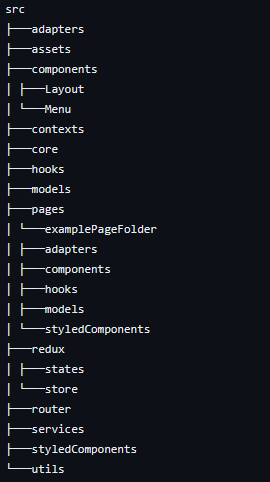

CRUZ ROJA FOOT PRINT

Configuración inicial

1. npm i
2. configurar prettier y eslint con los archivos de configuración en la raíz del proyecto
3. npm run dev para ejecutar el proyecto

Estructura de proyecto - screaming architecture

Biblioteca de diseño

- Material UI

Recomendaciones

- Actualizar los archivos de barril(index.ts) de un folder si se crea un nuevo archivo dentro de el.

Patrones de diseño
Se usa atomic design.
leer -https://danilowoz.com/blog/atomic-design-with-react

GitFlow.
leer - https://www.atlassian.com/git/tutorials/comparing-workflows/gitflow-workflow - https://www.freecodecamp.org/news/practical-git-and-git-workflows/
